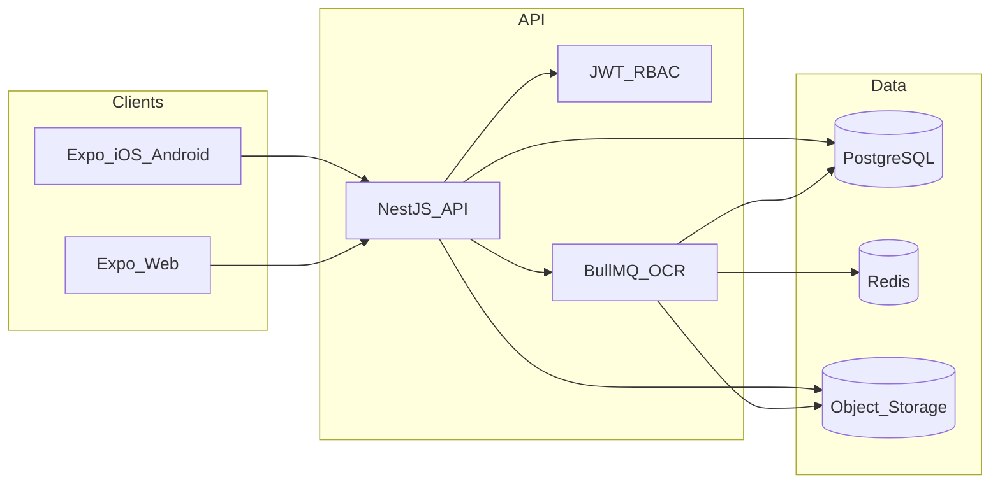
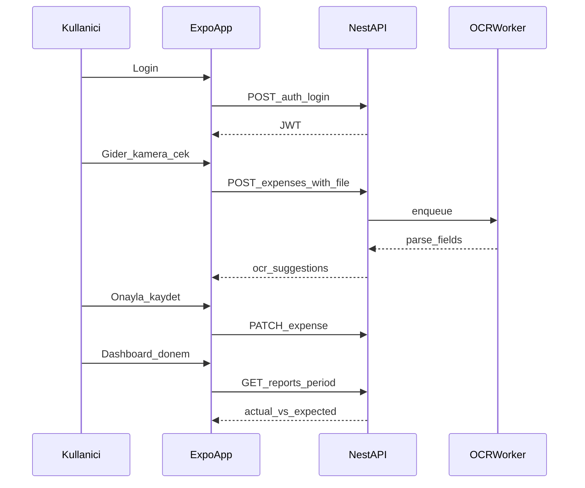

# Konfor Proje — Bakım / Gelir-Gider Sistemi Ürün Planı

**Kapsam:** Tek şirket, iç kullanım (SaaS değil)  
**İstemci:** Expo (React Native) ile ortak kod tabanı — iOS, Android ve Web  
**Dil / para birimi varsayılanı:** Türkçe arayüz, TRY, KDV oranları (%, 1 / 10 / 20)

---

## 1. Ürün özeti

Konfor Proje inşaat taahhüt şirketi için, mobil ve web’den kullanıcı adı / şifre ile giriş yapılan bir **finans operasyon paneli**.

Kullanıcılar:

- Fiili **gider** ve **gelir** girer (manuel veya fiş/fatura OCR).
- **Backlog** ile dönemsel beklenen gelir/gider planlar.
- **Dashboard**’da fiili vs projeksiyon karşılaştırmasını ve dönem raporlarını görür.
- **Admin** kullanıcıları hesap, kategori ve temel bakım verilerini yönetir.

---

## 2. Önerilen tech stack

| Katman | Seçim | Neden |
| --- | --- | --- |
| Monorepo | **pnpm workspaces + Turborepo** | Tek repo, paylaşılan tipler/validasyon, tek CI |
| Mobil + Web UI | **Expo (SDK 52+) + Expo Router** | 2-A tercihi: tek React Native kodu; `expo start --web` ile web |
| UI kit | **NativeWind (Tailwind)** + kısa özel bileşen seti | Web/mobil tutarlı stil, hızlı form ekranları |
| Form / validasyon | **React Hook Form + Zod** | Paylaşılan şemalar (`packages/shared`) |
| API istemcisi | **tRPC istemci** veya typed **OpenAPI fetch** | Tip güvenliği; öneri: tRPC (tek TS ekosistemi) |
| Backend | **NestJS (TypeScript)** | Modüler CRUD, RBAC, dosya upload, job’lar |
| ORM / DB | **Prisma + PostgreSQL** | İlişkisel finans verisi, migration, audit |
| Auth | **username/password + JWT (access) + refresh cookie/token** | İç kullanım; admin kullanıcı oluşturur (self-signup yok) |
| Dosya depolama | **S3 uyumlu** (başta MinIO local, prod’da R2/S3) | Fiş PDF/görsel |
| OCR | **Asenkron job + Vision API** (önce OpenAI Vision veya Google Document AI; TR fatura için) | Manuel fallback zorunlu |
| Kuyruk | **BullMQ + Redis** | OCR uzun sürebilir; UI’yı bloklamaz |
| Rapor / export | Server-side aggregation + **Excel (SheetJS)** / PDF | Dashboard ve dönem dökümü |
| Chart | **Victory Native** / **Recharts** (web’de Recharts tercih) | Dashboard grafikleri |
| Test | **Vitest** (unit) + **Playwright** (web E2E) + Expo smoke | |
| Deploy (öneri) | API + Postgres + Redis: **Fly.io / Railway / VPS**; web: Expo web static veya aynı Nest static; mobil: EAS Build | İç kullanım, düşük ops |

### Monorepo yapısı (hedef)

```text
apps/
  mobile/          # Expo Router (iOS, Android, Web)
  api/             # NestJS
packages/
  shared/          # Zod şemalar, DTO tipleri, para/KDV yardımcıları
  tsconfig/        # ortak TS config
```

### Mimari akış



---

## 3. Roller ve yetkiler (RBAC)

| Rol | Yetki özeti |
| --- | --- |
| `ADMIN` | Kullanıcı CRUD, kategori CRUD, sistem ayarları, tüm kayıtlar, silme |
| `FINANS` | Gelir/gider/backlog giriş-düzenleme, dashboard, export, tedarikçi |
| `IZLEYICI` | Sadece dashboard ve rapor (salt okunur) |

İlk sürümde 3 rol yeter; şantiye bazlı kısıtlama Faz 2’de eklenebilir.

---

## 4. Alan modeli (çekirdek)

### 4.1 Kullanıcı (`User`)

- `username` (benzersiz), `passwordHash`, `displayName`, `role`, `isActive`
- Admin panelinden oluşturma / şifre sıfırlama / pasifleştirme
- Self-registration **yok**

### 4.2 Kategori (`Category`) — tag gibi çoklu seçim

- `name`, `type` (`EXPENSE` | `INCOME` | `BOTH`), `color`, `isActive`, `sortOrder`
- Gelir ve gider aynı kategori havuzunu kullanabilir (`BOTH` veya tipe göre filtre)
- Soft-delete / pasifleştirme (eski kayıtlarda isim bozulmasın)

### 4.3 Tedarikçi (`Supplier`) — gider için

- `name`, `taxId` (VKN opsiyonel), `notes`, `isActive`
- Gider formunda serbest metin yerine (veya yanında) seçim; OCR’dan öneri

### 4.4 Gider (`Expense`)

- `amount` (kuruş/integer veya `Decimal`), `currency` (varsayılan TRY)
- `taxMode`: `INCLUDED` | `EXCLUDED`
- `vatRate` (0, 1, 10, 20 — TR)
- Hesaplanan: `netAmount`, `vatAmount`, `grossAmount`
- `description`, `expenseDate`, `supplierId?`, `categories[]` (N:N)
- `attachments[]` (PDF/görsel), `ocrStatus`, `ocrRawJson?`
- `createdBy`, `updatedAt`, audit

### 4.5 Gelir (`Income`)

- `amount`, `description`, `incomeDate`, `categories[]`
- `taxMode` / `vatRate` (gider ile aynı model — tutarlı raporlama)
- Opsiyonel: `counterparty` (müşteri/proje adı metni; Faz 2’de proje FK)

### 4.6 Backlog kalemi (`BacklogItem`)

- `direction`: `INCOME` | `EXPENSE`
- `periodMonth`, `periodYear` (veya `periodStart`/`periodEnd`)
- `expectedAmount`, `description`, `categories[]`
- `status`: `PLANNED` | `PARTIAL` | `DONE` | `CANCELLED`
- Opsiyonel bağ: gerçekleşen `expenseId` / `incomeId` listesi (projeksiyon farkı için)

### 4.7 Dönem özeti (hesaplanan view / API)

Belirli `year-month` için:

- Beklenen gelir / gider (backlog toplamı)
- Fiili gelir / gider
- Fark (Δ) ve gerçekleşme oranı (%)
- Kategori ve tedarikçi kırılımı

---

## 5. Ekran envanteri (web + mobil)

Ortak navigasyon (Expo Router):

```text
/(auth)/login
/(app)/dashboard
/(app)/expenses/index | new | [id]
/(app)/incomes/index | new | [id]
/(app)/backlog/index | new | [id]
/(app)/reports/period
/(app)/admin/users
/(app)/admin/categories
/(app)/admin/suppliers
/(app)/account/password
```

### 5.1 Giriş

- Kullanıcı adı + şifre
- “Beni hatırla” (refresh token)
- Hatalı giriş rate-limit (API)
- Mobil: klavye / autofill uyumlu; web: Enter ile submit

### 5.2 Dashboard (karşılama)

- Dönem seçici (ay / yıl)
- KPI kartları: Fiili gelir, fiili gider, net, backlog beklenen gelir/gider, Δ projeksiyon
- Grafik: aylık trend (son 6–12 ay), kategori pasta/bar
- Hızlı aksiyonlar: + Gider, + Gelir, Backlog’a git
- Mobil: üstte KPI swipe/scroll; web: 2 sütun yoğun layout

### 5.3 Gider listesi + giriş

**Liste:** arama, tarih aralığı, kategori, tedarikçi, tutar filtresi; satırda tutar + KDV rozeti.

**Form alanları:**

| Alan | Zorunlu | Not |
| --- | --- | --- |
| Kategoriler | Evet (≥1) | Çoklu seçim (tag) |
| Tutar | Evet | |
| Vergi | Evet | Dahil / Hariç + KDV oranı |
| Tarih | Evet | |
| Açıklama | Evet | |
| Tedarikçi | Hayır | Seç veya hızlı ekle |
| Ekler | Hayır | Kamera / galeri / PDF |

**OCR akışı:**

1. Kullanıcı foto/PDF yükler veya kamerayla çeker.
2. Kayıt `ocrStatus=PROCESSING` ile oluşur veya taslak kalır.
3. Job tutar, tarih, tedarikçi, KDV, açıklama önerir.
4. Kullanıcı onaylar / düzeltir → kaydet.
5. OCR başarısızsa tam manuel giriş.

### 5.4 Gelir listesi + giriş

Alanlar: kategoriler, açıklama, tarih, tutar (+ vergi modeli gider ile aynı).  
OCR Faz 1’de opsiyonel (gider öncelikli).

### 5.5 Backlog (planlama)

- Ay/yıl bazlı board veya tablo
- Satır: yön (gelir/gider), beklenen tutar, kategori, açıklama, durum
- “Fiiliye bağla”: gerçekleşen kayıttan eşleştir → Δ otomatik
- Toplu dönem kopyala (önceki ayı kopyala) — üretkenlik

### 5.6 Raporlar

- Projeksiyon vs fiili (dönem)
- Backlog bekleyenler
- Fiili gelir/gider detay (drill-down)
- Export: Excel / CSV (web öncelikli; mobilde paylaş)

### 5.7 Admin bakım

- **Kullanıcılar:** oluştur, rol, aktif/pasif, şifre sıfırla
- **Kategoriler:** ekle/düzenle, tip, renk, sıralama, pasif
- **Tedarikçiler:** bakım
- İleride: KDV varsayılanları, şirket unvanı, logo (PDF çıktı)

---

## 6. Dashboard metrikleri (hesap kuralları)

Belirli dönem `P` için:

```text
expectedIncome(P)  = Σ BacklogItem(INCOME, P, status ≠ CANCELLED).expectedAmount
expectedExpense(P) = Σ BacklogItem(EXPENSE, P, status ≠ CANCELLED).expectedAmount
actualIncome(P)    = Σ Income where incomeDate ∈ P
actualExpense(P)   = Σ Expense.grossAmount where expenseDate ∈ P

deltaIncome  = actualIncome  - expectedIncome
deltaExpense = actualExpense - expectedExpense
netActual    = actualIncome - actualExpense
netExpected  = expectedIncome - expectedExpense
```

Vergi: listelerde **brüt** gösterim varsayılan; raporda net / KDV kırılımı ayrı sekme.

---

## 7. Ek özellik önerileri (inşaat taahhüt bağlamı)

Öncelik: **P0** = ilk sürümde olmalı, **P1** = hemen sonrası, **P2** = büyüyünce.

| Özellik | Öncelik | Açıklama |
| --- | --- | --- |
| Proje / şantiye maliyet merkezi | P1 | Her gelir-gidere `projectId`; dashboard’da şantiye kırılımı |
| Hakediş / sözleşme takibi | P1 | Sözleşme bedeli, kesinti, tahsilat vs plan |
| Onay akışı | P1 | Limit üstü gider → yönetici onayı (PENDING) |
| Tekrarlayan gider | P1 | Kira, leasing; ay başı backlog veya fiili önerisi |
| Tedarikçi kartı + borç yaşlandırma | P1 | Ödenen / kalan; 30-60-90 gün |
| Nakit akışı takvimi | P1 | Backlog + vade tarihi ile haftalık cashflow |
| Banka / kasa hesapları | P2 | Hesap bazlı bakiye (basit defter) |
| Çek / senet | P2 | İnşaatta yaygın; vade hatırlatma |
| Fatura no / e-belge no | P1 | Tekillik kontrolü, mükerrer OCR engeli |
| Excel içe aktarma | P2 | Eski muhasebe dökümü migrasyonu |
| Bildirimler | P1 | OCR bitti, onay bekliyor, dönem kapanışı |
| Denetim günlüğü | P0 | Kim neyi değiştirdi (iç kontrol) |
| Soft delete + geri al | P0 | Yanlış silinen fiş |
| Offline taslak (mobil) | P2 | Şantiyede zayıf sinyal; sonra sync |
| Çoklu para birimi | P2 | EUR makine kirası vb. |
| Bütçe limiti uyarıları | P1 | Kategori/proje aşımı |
| PDF dönem raporu (yönetim) | P1 | Aylık tek sayfa özet |
| Mobil widget / hızlı kamera gider | P1 | Ana ekrandan tek dokunuşla fiş |

---

## 8. UX ilkeleri (web + mobil rahat kullanım)

1. **Mobil-first fiş girişi, web-first rapor.** Aynı kod; layout breakpoint ile yoğun tablo web’de, büyük dokunma alanları mobilde.
2. **3 dokunuşta gider:** Dashboard → + Gider → Kamera → OCR önerisi onay.
3. **Taslak kaydet** her formda (OCR beklerken kaybolmasın).
4. **Türkçe etiketler**, sayı formatı `1.234,56 ₺`, tarih `GG.AA.YYYY`.
5. **Boş durumlar:** “Bu ay backlog yok — kopyala / ekle” CTA.
6. **Yetkisiz ekran gizleme** (admin menüsü sadece ADMIN).
7. **Erişilebilirlik:** form hataları alan altında; kontrastlı KPI.
8. **Performans:** liste sayfalama; dashboard tek aggregate endpoint.

### Tipik kullanıcı yolculukları



---

## 9. Güvenlik (iç kullanım)

- HTTPS only; şifre **argon2id**
- JWT kısa ömür + refresh rotasyonu
- Rol bazlı guard’lar (Nest)
- Upload: MIME/size whitelist (PDF, JPEG, PNG, HEIC→JPEG)
- Admin işlemleri audit log
- Ortam sırları `.env` / secret store; repo’ya yazılmaz
- Yedek: günlük Postgres dump

---

## 10. Uygulama fazları

Faz 0–4 bu repoda uygulandı (Redis / OpenAI / MinIO ortam değişkenleri opsiyonel; yoksa yerel fallback).

### Faz 0 — İskelet (1 sprint)

- Monorepo, NestJS + Prisma + Postgres, Expo Router web/mobil
- Login, User admin CRUD, seed admin kullanıcısı
- Healthcheck, AGENTS.md / README kurulum

### Faz 1 — MVP çekirdek (sizin tarifiniz)

- Kategori + tedarikçi bakım
- Gider (manuel + ek yükleme), gelir manuel
- Backlog dönem planı
- Dashboard fiili vs beklenen
- Dönem raporu + Excel export
- Audit + soft delete

### Faz 2 — OCR + mobil hız

- BullMQ OCR pipeline, öneri UI, mükerrer fatura no
- Kamera akışı, bildirim (OCR bitti)
- Proje/şantiye alanı

### Faz 3 — İnşaat finans derinliği

- Onay akışı, hakediş, nakit akışı, tedarikçi yaşlandırma
- PDF yönetim raporu, bütçe uyarıları

### Faz 4 — Operasyonel olgunluk

- Offline taslak, çoklu para, çek/senet, banka hesapları

---

## 11. Başarı kriterleri (MVP)

- Admin kullanıcı oluşturup şifre ile web ve mobilde giriş
- En az 1 kategori ile gider + gelir kaydı
- Backlog’da bir ay için beklenen gelir/gider
- Dashboard’da aynı dönem için fiili vs projeksiyon sayılarının doğruluğu
- En az 1 ek (görsel/PDF) gider kaydına bağlanabilmesi (OCR sonraki fazda otomatik doldurma)

---

## 12. Bilinçli dışarıda bırakılanlar (MVP)

- Multi-tenant / SaaS
- Self-service kayıt / SSO (sonra eklenebilir)
- Tam muhasebe (yevmiye, mizan) — bu ürün operasyonel gelir-gider + plan; e-Defter değil
- App Store yayın zorunluluğu ilk günden (EAS internal / ad-hoc yeterli olabilir)

---

## 13. Sonraki adım

Bu plan onaylandıktan sonra önerilen sıra:

1. Repo iskeleti (Turborepo + Expo + Nest + Prisma)
2. Auth + admin kullanıcı
3. Kategori / gider / gelir / backlog / dashboard sırasıyla

Onay veya öncelik değişikliği (ör. OCR’ı MVP’ye almak, şantiye alanını Faz 1’e çekmek) ürün backlog’unu günceller.
